<div align="center">

# Hi, I'm Nawaz Ahammed 👋

<picture>
  <source media="(prefers-color-scheme: dark)" srcset="assets/banner.svg">
  <source media="(prefers-color-scheme: light)" srcset="assets/banner-light.svg">
  
</picture>

<br>

[](https://linkedin.com/in/nawaz-ahammed-32b393135)
[](mailto:nawazahmedkhan@gmail.com)
[](#)

</div>

<br>

## About Me

I'm an achievement-driven MCA candidate at **Atria Institute of Technology (VTU)**, Bengaluru, with hands-on expertise in Python development, full-stack web engineering, and AI/ML application development. During a 90-day software development internship at **Tech Citi Technologies Pvt. Ltd.**, I delivered a production-grade Employee Web Interface and earned an **Outstanding Performance Award** from senior leadership.

I'm **Google Gemini Certified**, with practical experience in prompt engineering, generative AI tooling, and AI-assisted development workflows. Alongside my technical work, I spent two years as **BCA Student Council President**, leading academic governance for 200+ students, and I currently serve as **Student Placement Coordinator** for my MCA department.

I'm targeting **Software Engineering, Python Developer, AI/ML, and Full-Stack Developer** roles at MNCs, product-based companies, and AI-first startups.

<br>

## Current Focus

<table>
<tr>
<td width="25%" valign="top">

**🔭 Learning**
- Advanced AI/ML application design
- LLM integration patterns
- Scalable full-stack architecture

</td>
<td width="25%" valign="top">

**🛠️ Building**
- Full-stack web applications
- AI-assisted development workflows
- Clean, reusable UI components

</td>
<td width="25%" valign="top">

**🔬 Researching**
- Generative AI application design
- Prompt engineering best practices
- Relational database optimization

</td>
<td width="25%" valign="top">

**🎯 Career Goal**
- Software Engineering / AI-ML roles
- Product-based &amp; AI-first companies
- Full-Stack Developer positions

</td>
</tr>
</table>

<br>

## Technical Skills

<table>
<tr>
<td width="50%" valign="top">

**Programming Languages**
`Python` `JavaScript (ES6+)` `HTML5` `CSS3` `SQL`

**AI &amp; Machine Learning**
`Machine Learning` `Prompt Engineering` `Generative AI` `Google Gemini API` `LLM Integration` `AI-Assisted Development` `AI-First Software Engineering`

**Web Development**
`Full-Stack Development` `Responsive UI Design` `Front-End Engineering` `Cross-Browser Compatibility` `DOM Manipulation` `UI/UX Principles`

</td>
<td width="50%" valign="top">

**Database Management**
`MySQL` `Relational Database Design` `Schema Modeling` `CRUD Operations` `Query Optimization` `Data Integrity`

**Developer Tools**
`Git` `GitHub` `VS Code` `Version Control` `SDLC` `Agile Fundamentals` `Debugging & Testing`

**Core CS Concepts**
`Data Structures` `Algorithms` `Object-Oriented Programming` `Problem Solving` `Software Engineering Principles`

</td>
</tr>
</table>

<br>

## Professional Experience

```text
2024  Software Development Intern · Tech Citi Technologies Pvt. Ltd.
      JP Nagar, Bengaluru, India · Full-Time Internship (90+ days)
      Jun 2024 – Sep 2024

      • Engineered an end-to-end Employee Web Interface managing records
        for 100+ employees — responsive UI, MySQL backend integration,
        and real-time operational workflows.
      • Architected normalized relational database schemas and optimized
        SQL queries, improving retrieval speed and referential integrity.
      • Developed modular, reusable front-end components in HTML5, CSS3,
        and JavaScript with cross-browser, mobile-responsive support.
      • Implemented CRUD operations, client-side validation, and secure
        data workflows, ensuring zero data inconsistency.
      • Participated in Agile-aligned cycles — code reviews, QA testing,
        iterative debugging alongside senior engineers.

      🏆 Awarded Outstanding Performance Grade by organizational
         leadership for code quality, delivery, and professional conduct.
```

<br>

## Featured Projects

<table>
<tr>
<td width="50%" valign="top">

### 🖥️ Employee Web Interface
**Full-Stack Web Application · Internship Project**
*Jun – Sep 2024*

A production-level employee management system handling complete lifecycle operations — onboarding, records management, and resource allocation.

- Scalable, component-based front-end with responsive design patterns
- MySQL relational backend with normalized schemas for real-time data operations
- End-to-end error handling, client-side validation, and data integrity constraints
- Validated through systematic unit and integration testing

`HTML5` `CSS3` `JavaScript` `MySQL` `VS Code`

</td>
<td width="50%" valign="top">

### ♿ Elders Seva — Digital Accessibility Platform
**Hackathon Project**
*2026 · UIDAI Hackathon 2026 · Google Hackathon*

An accessibility-first web application addressing digital inclusion challenges for elderly citizens, with biometric sensor integration and simplified UX design.

- Applied User-Centered Design (UCD) principles for high-contrast, intuitive interfaces
- Rapid prototyping and agile product thinking under hackathon time constraints
- Selected participant at UIDAI Hackathon 2026 and Google Hackathon

`HTML5` `CSS3` `JavaScript`

</td>
</tr>
</table>

<br>

## Certifications

<table>
<tr>
<td align="center" width="33%">

**🐍 Python for Data Science**
Infosys Springboard · 2024

</td>
<td align="center" width="33%">

**💬 Prompt Engineering &amp; AI-First Software Engineering**
Infosys Springboard · 2024

</td>
<td align="center" width="33%">

**✨ Google Gemini Certified**
Generative AI &amp; AI Fundamentals · Google · 2024

</td>
</tr>
</table>

<br>

## Leadership

```text
2023 – 2025   Student Council President, BCA Department
              Prayukthi International College
              • Governed and led a student body of 200+ students across
                2 academic years — academic governance, departmental
                events, inter-college competitions.
              • Primary liaison between students and faculty administration,
                driving feedback loops and departmental improvements.

2025 – Present Student Placement Coordinator, MCA Department
              Atria Institute of Technology
              • Coordinating industry-academia partnerships for internship
                and placement drives with technology and consulting firms.
              • Supporting 50+ MCA students through resume workshops, mock
                interviews, and company-specific recruitment briefings.

              Lead Technical Event Coordinator
              • Organized and managed 5+ inter-departmental technical
                workshops, hackathon bootcamps, and coding competitions.
```

<br>

## Education

| Degree | Institution | Duration | Highlight |
|---|---|---|---|
| **Master of Computer Applications (MCA)** | Atria Institute of Technology, Bengaluru · VTU Affiliated | 2025 – Present (Expected 2027) | — |
| **Bachelor of Computer Applications (BCA)** | Prayukthi International College, Bengaluru City University | 2022 – 2025 | CGPA 8.89/10.0 · Best Student of the Batch |

<br>

## GitHub Analytics

<div align="center">




<br><br>



</div>

> Generated locally from the GitHub REST API and refreshed nightly by [`update-stats.yml`](.github/workflows/update-stats.yml) — no third-party stats services involved.

<br>

## Contribution Snake

<div align="center">

<picture>
  <source media="(prefers-color-scheme: dark)" srcset="https://raw.githubusercontent.com/nawazahammed2002/nawazahammed2002/output/github-snake-dark.svg">
  
</picture>

</div>

> Generated automatically every day by [`github-snake.yml`](.github/workflows/github-snake.yml) and published to the `output` branch.

<br>

## Badge

<div align="center">

</div>

<br>

## Connect

<div align="center">

[](https://github.com/nawazahammed2002)
[](https://linkedin.com/in/nawaz-ahammed-32b393135)
[](mailto:nawazahmedkhan@gmail.com)

*Bengaluru, Karnataka, India · +91 86602 12495*

</div>

<br>

<div align="center">
<sub>Every fact on this page is sourced from my resume and the live GitHub API — nothing fabricated.</sub>
</div>
